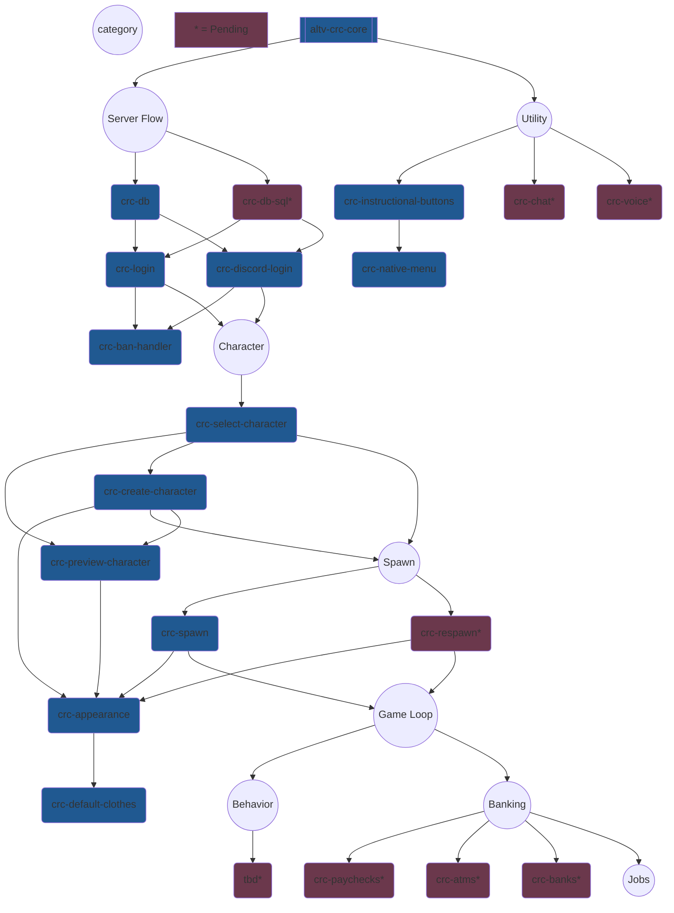

# alt:V Cross Resource Community

This is an experimental project that will allow users to quickly drag / drop resources into a structured server infrastructure.

Think of each resource as a micro-service for your gamemode.

## Ideology

- TypeScript
- Very small resources
- Maximum performance with least overhead
- Shared database so credentials automatically are associated with all other resources
- Near one-click solutions for most server components
- Cross resource compatability

## Installation

- [Install on Windows](https://github.com/orgs/altv-crc/discussions/1)
- [Install a Plugin](https://github.com/orgs/altv-crc/discussions/2)

## Discussions & Help

- [Announcements](https://github.com/orgs/altv-crc/discussions/categories/announcements)
- [Plugins](https://github.com/orgs/altv-crc/discussions/categories/plugins)
- [Q & A](https://github.com/orgs/altv-crc/discussions/categories/q-a)

## Development Stack

 

 

## Recommended Infrastructure

Below is a general mindmap that shows what resources need to exist to create a login flow that leads a player to the eventual game loop.

Every section with `crc-` should be considered an individual resource that has been built, or needs to be built.

The `*` means the resource has not been built.

[Built with mermaid.live](https://mermaid.live/)
