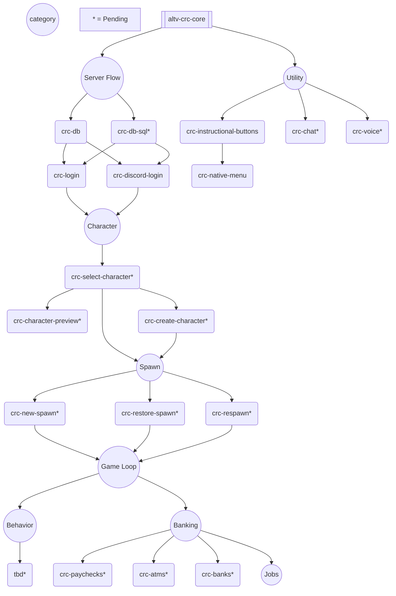

# alt:V Cross Resource Community

This is an experimental project that will allow users to quickly drag / drop resources into a structured server infrastructure.

Think of each resource as a micro-service for your gamemode.

## Ideology

- TypeScript
- Very small resources
- Maximum performance with least overhead
- Shared database so credentials automatically are associated with all other resources
- Near one-click solutions for most server components
- Cross resource compatability

## Discussions & Help

- [Announcements](https://github.com/orgs/altv-crc/discussions/categories/announcements)
- [Plugins](https://github.com/orgs/altv-crc/discussions/categories/plugins)
- [Q & A](https://github.com/orgs/altv-crc/discussions/categories/q-a)
- [Tutorials](https://github.com/orgs/altv-crc/discussions/categories/tutorials)

## Development Stack


<br />

<br />


## Cross Resource Event Specifications

Every resource should have an event system related to its name.

* If your resource is called `crc-my-resource` then your resource should recieve events through it.

```ts
alt.on('crc-my-resource', (functions: { a?: string, b?: string) => {
    alt.log(`got action`);
});
```

* Event parameters should always be a single object that can be deconstructed to point towards specific functions

```ts
function handleActions(functions: { set?: Array<{ text: string; input: string }>; clear?: boolean }) {
    if (typeof functions !== 'object') {
        return;
    }

    // This allows for action properties to clearly be defined and pushed to the right functions
    const { set, clear } = functions;

    if (set) {
        setFunc(set);
    }

    if (clear) {
        clearFunc();
    }
}

alt.on('crc-instructional-buttons', handleActions);
```

* Why this event specification?
  
This ensures that as you add new functionality, the previous events remain always useable. In most cases.

Users can upgrade to new versions of individual resources and still be able to call those events.

This ensures backwards compatability as long as the developer chooses to retain it.

Objects can always add new parameters easily. Arrays cannot.

## Recommended Infrastructure

Below is a general mindmap that shows what resources need to exist to create a login flow that leads a player to the eventual game loop.

Every section with `crc-` should be considered an individual resource that has been built, or needs to be built.

The `*` means the resource has not been built.



[Built with mermaid.live](https://mermaid.live/)
