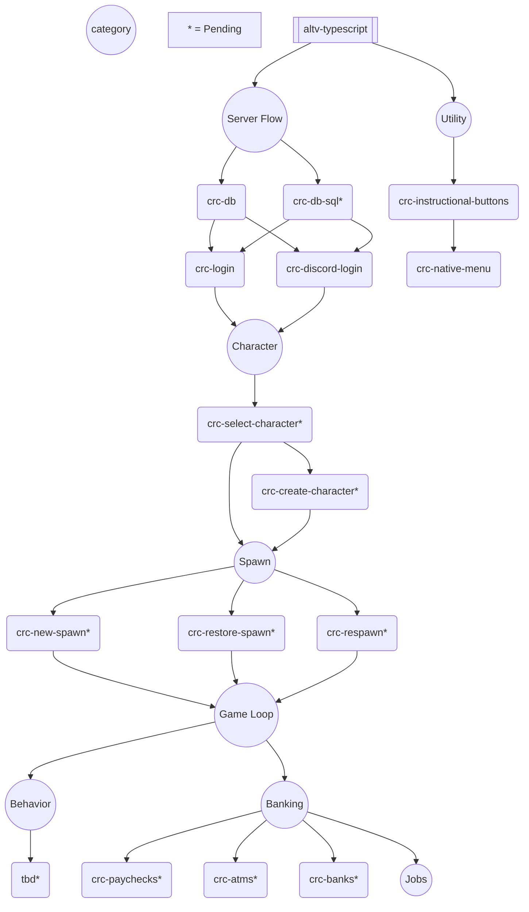

# alt:V Cross Resource Community

A collection of useful resources, and recommendations to build faster.

## Development Stack

 

 

## Ideology

- TypeScript
- Very small resources
- Maximum performance with least overhead
- Near one-click solutions for most server components
- Cross resource compatability

## Recommended Infrastructure

Below is a general mindmap that shows what resources need to exist to create a login flow that leads a player to the eventual game loop.

Every section with `crc-` should be considered an individual resource that has been built, or needs to be built.

The `*` means the resource has not been built.

